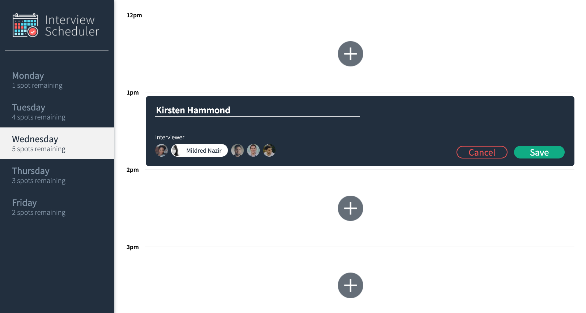
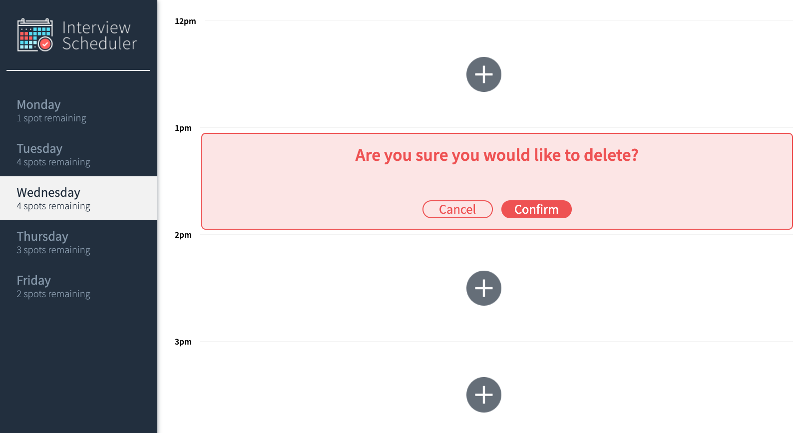
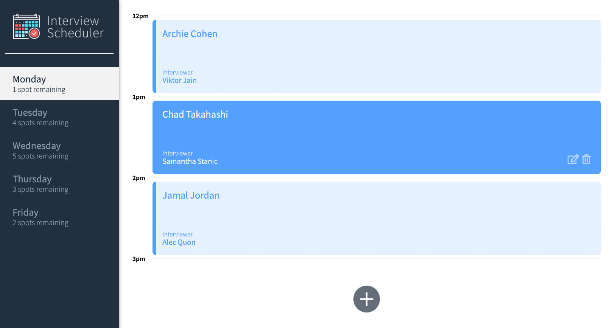
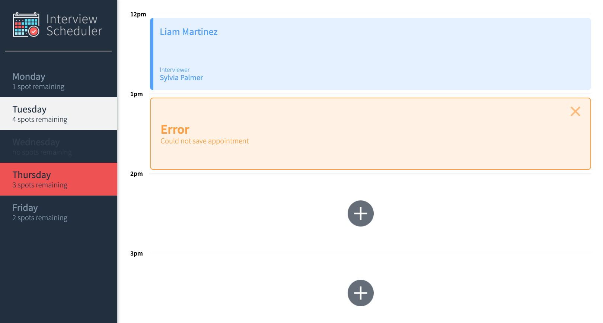

# Interview Scheduler

Interview Scheduler is a SPA, built using React. It was created for students to be able to book and manage interviews with lecturers.

Data is persisted by an API server using a PostgreSQL database. The client side communicates with an API server over HTTP, using JSON. 

Unit, integration and end-to-end testing has been implemented with Storybook, Jest and Cypress.

---
## Final Product

---

## Getting Started

1. Clone this repository onto your local device.
2. Install dependencies using the `npm install` command.
3. Start the Webpack Development server using the `npm start` command. 
  - Fork and clone the [Scheduler_API](https://github.com/lighthouse-labs/scheduler-api) database and repeat steps 2 and 3 along with the README.
  - Both servers run concurrently. Requests are proxied from Webpack to the API server. 
4. Run the Jest framework by using `npm test`.
5. See the StoryBook visual testbed by running `npm run storybook`. 

---

## Dependencies

- React
- Webpack, Babel
- Axios
- Storybook, Jest, Cypress, Testing Library

### DevDependencies
 - Classnames
 - Sass
 - Prop Types

---
### Acknowledgements

The styling has been provided by LightHouse Labs. The master branch can be found [here](https://github.com/lighthouse-labs/scheduler/).
